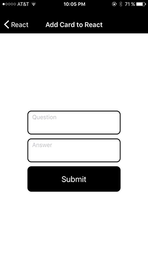

# Mobile Flashcards

User can create a deck and add a cards (question and answer) to it. Then quiz themself on a deck. The data is stored in the AsynStorage and if no data exists yet it is some test data loaded.
(App is only tested on iPhone with Expo app)

## Decks View

## New Deck View

## Deck Detail View

## Add Card View

## Quiz View

## Try out

To try out the final project:

* Install and start the project
    - `yarn install`
    - `yarn start`
    - Open the project through the Expo app
